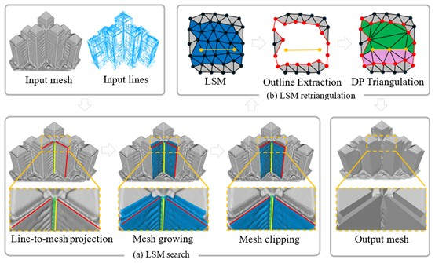

# Efficient Multi-objective Dynamic Programming for Building Mesh Optimization with 3D Lines

An accurate and efficient dynamic programming framework for optimizing building meshes with 3D line constraints.

[](https://opensource.org/licenses/MIT)
[](https://en.wikipedia.org/wiki/C%2B%2B17)
[](#)

## Overview

This project implements an efficient dynamic programming-based framework for optimizing building meshes using 3D line constraints. The method refines existing meshes by leveraging 3D line segments to improve representation of edges and planes, without global remeshing.

### Algorithm Workflow

The algorithm follows a comprehensive pipeline designed for efficient building mesh optimization with 3D line constraints:

1. **Input Processing**: Accepts 3D lines and an existing mesh as input data
2. **LSM search**: For each 3D line, the corresponding local mesh region (LSM) is identified:
   - **Line-to-mesh projection**: The 3D line is projected onto the mesh to initialize the LSM for optimization
   - **Mesh growing**: A greedy growth strategy with coplanar consistency constraints is applied to determine the maximal optimization region
   - **Mesh clipping**: When multiple 3D lines are used, overlapping LSMs are refined using an iterative shrinking strategy to reduce false positives
3. **LSM Retriangulation**: Constructs candidate planes and evaluates fitness
   - **Initialization**: A preprocessing step that converts each LSM into a retriangulation problem, including LSM boundary extraction and 3D line segmentation.
   - **Retriangulation with dynamic programming**: A dynamic programming framework jointly minimizes perimeter and dihedral angle for optimal retriangulation
   - **Accurate retriangulation**: Adaptive multi-objective weighting is applied to balance multiple optimization goals
   - **Efficient retriangulation**: A probabilistic decision model is used to reduce redundant computations and improve efficiency

## Requirements

- C++11 compatible compiler
- CMake 3.10 or higher
- Required libraries: Eigen3, PCL

## Building

```bash
git clone https://github.com/XiaotongLi123/mesh-optimization-with-3D-building-lines.git
cd mesh_optimization/C++
mkdir build && cd build
cmake .. -DCMAKE_BUILD_TYPE=Release
make -j$(nproc)
```

## Data Format

Input data should be in .obj format.

## License

This project is licensed under the MIT License - see the [LICENSE](LICENSE) file for details.

